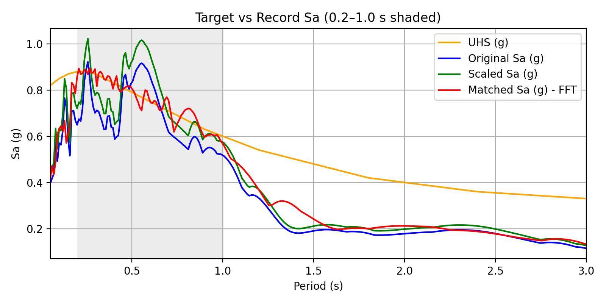
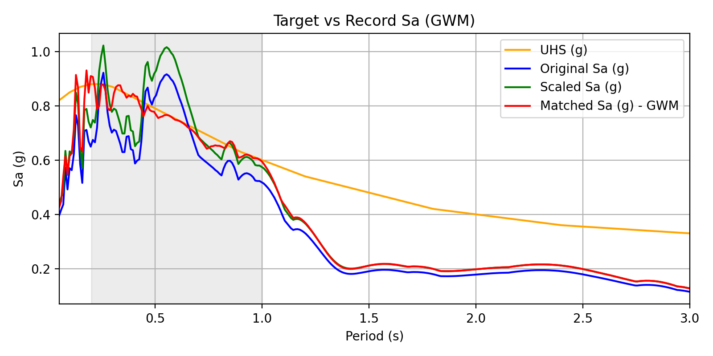
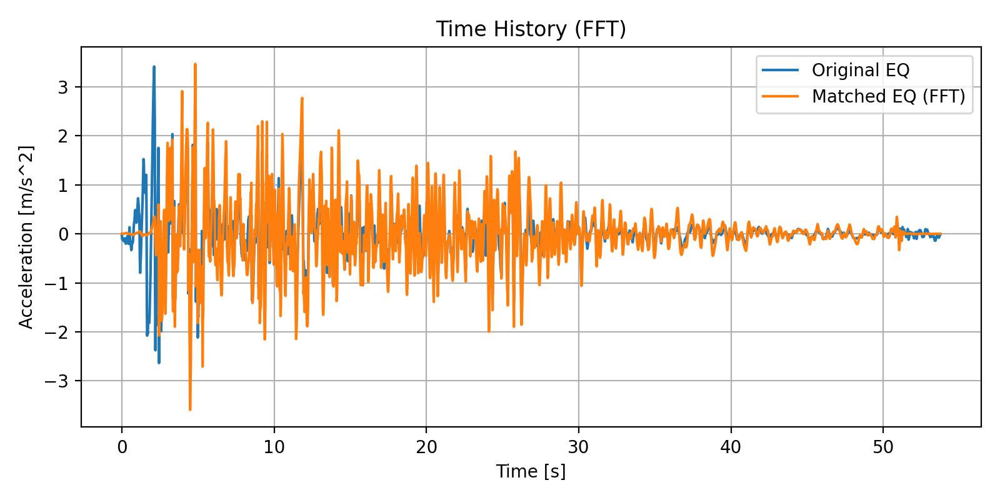
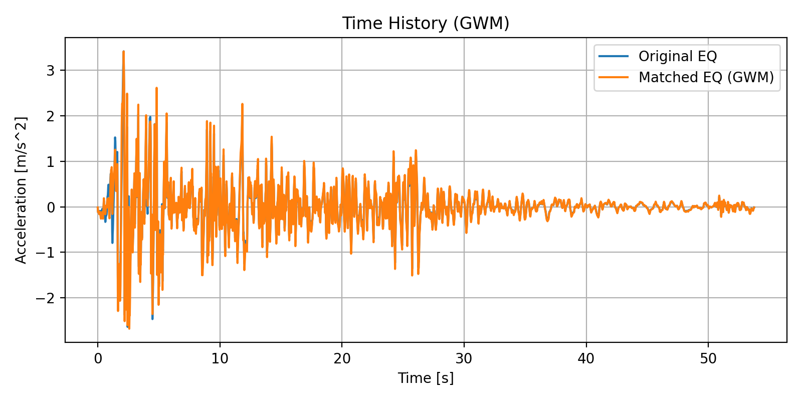
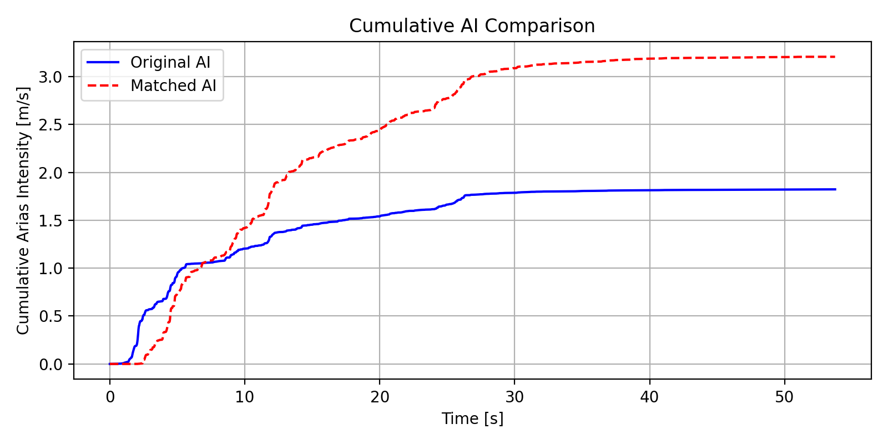
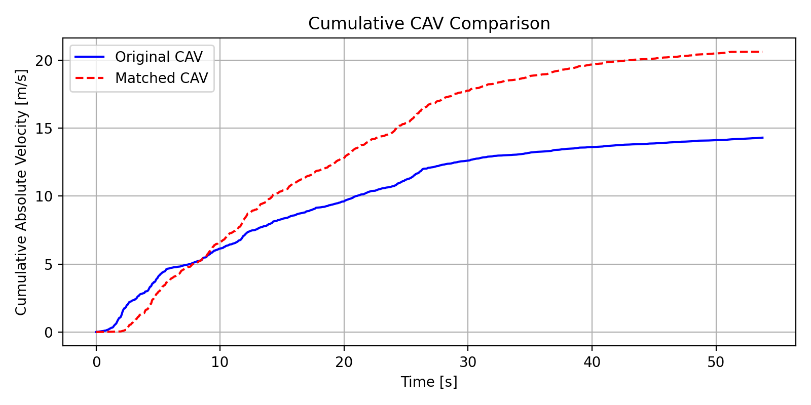

# Spectral Matching

A Python package for matching earthquake ground motion acceleration records to target response spectra using iterative FFT and Greedy Wavelet Matching (GWM) methods.

## Features

- **Iterative FFT Matching**: Frequency-domain spectral matching using iterative FFT adjustments
- **Greedy Wavelet Matching**: Time-domain matching using tapered cosine wavelets
- **Response Spectrum Computation**: Accurate piecewise-exact SDOF solver
- **Intensity Metrics**: Arias Intensity (AI) and Cumulative Absolute Velocity (CAV)
- **Visualization**: Comprehensive plotting tools for spectra, time histories, and cumulative metrics

## Installation

1. Clone the repository:
```bash
git clone <repository-url>
cd spectral_matching
```

2. Install dependencies:
```bash
pip install -r requirements.txt
```

## Project Structure

```
spectral_matching/
├── src/
│   ├── spectral_matching/      # Main package
│   │   ├── __init__.py         # Package initialization
│   │   ├── constants.py        # Loads constants from config.ini
│   │   ├── solvers.py          # SDOF solver and response spectrum
│   │   ├── metrics.py          # Earthquake intensity metrics
│   │   ├── matching.py         # FFT and GWM matching algorithms
│   │   ├── io.py               # File I/O operations
│   │   ├── preprocessing.py    # Data preprocessing functions
│   │   └── plotting.py         # Plotting utilities
│   ├── main.py                 # Main execution script
│   ├── data/                   # Input data files
│   │   ├── elcentro_NS.dat.txt
│   │   └── uhs_el_centro.csv
│   ├── figures/                # Generated plots
│   └── output/                 # Matched acceleration records
├── requirements.txt
├── config.ini            # Configuration file
└── README.md
```

## Usage

### Basic Usage

Run the main script:

```bash
cd src
python main.py
```

This will:
1. Load the acceleration record from `data/elcentro_NS.dat.txt`
2. Load the target spectrum from `data/uhs_el_centro.csv`
3. Perform baseline correction and scaling
4. Apply both FFT and GWM matching methods
5. Generate plots and save matched records

### Using as a Package

```python
from spectral_matching import (
    load_acceleration_record,
    load_target_spectrum,
    iterative_fft_match,
    response_spectrum,
    plot_spectra
)

# Load data
time, acc, dt = load_acceleration_record("data/record.dat.txt")
periods, target_spectrum = load_target_spectrum("data/target.csv")

# Match spectrum
acc_matched = iterative_fft_match(acc, dt, periods, target_spectrum)

# Compute response spectrum
spectrum = response_spectrum(acc_matched, dt, periods)
```

## Configuration

Key parameters can be adjusted in `config.ini` located in the project root directory:

- **Physical**: `gravity` - Gravitational acceleration constant
- **Default**: `damping` - Damping ratio (default: 0.05), `target_period_band_min/max` - Target period range
- **FFT_Matching**: `fft_iters`, `fft_smooth_width`, `fft_ratio_clip_min/max`, `fft_gain_clip_min/max`, `fft_tukey_alpha`
- **Period_Grid**: `num_periods`, `period_min`, `period_max` - Period grid parameters
- **GWM**: `gwm_iters`, `gwm_tol`, `gwm_gamma`, `gwm_ai_multiplier` - Greedy Wavelet Matching parameters
- **Numerical**: `numerical_eps` - Numerical tolerance

The configuration file uses INI format with sections. All values are automatically loaded when the package is imported.

## Output

The script generates:

- **Plots** (saved to `src/figures/`):
  - Response spectra comparison
  - Cumulative AI and CAV plots
  - Time history comparisons

- **Matched Records** (saved to `output/`):
  - `*_matched_iterative.dat.txt`: FFT-matched record
  - `*_matched_gwm.dat.txt`: GWM-matched record

### Example results (El Centro NS, period band 0.20–1.00 s, 5% damping)

**Response spectra** — target vs scaled vs matched:

| Iterative FFT | Greedy Wavelet Matching |
|---------------|--------------------------|
|  |  |

**Time histories** — original/scaled vs matched:

| Iterative FFT | Greedy Wavelet Matching |
|---------------|--------------------------|
|  |  |

**Cumulative intensity metrics** (iterative FFT run):

| Arias Intensity (AI) | Cumulative Absolute Velocity (CAV) |
|----------------------|------------------------------------|
|  |  |

## Methods

### Iterative FFT Matching

Adjusts the frequency content of the acceleration record iteratively to match the target spectrum. Uses FFT-based frequency domain modifications with smoothing and clipping to ensure stability.

### Greedy Wavelet Matching

Adds tapered cosine wavelets to the acceleration record to iteratively improve the match. Constrains the Arias Intensity to prevent unrealistic amplification.

## Method Comparison

The following table compares the performance of different matching methods on the El Centro NS record (target period band: 0.20-1.00s, damping: 5%). The [example results above](#example-results-el-centro-ns-period-band-020100-s-5-damping) show the corresponding spectra, time histories, and cumulative metrics.

| Method | Match % | Arias Intensity (AI) [m/s] | Cumulative Absolute Velocity (CAV) [m/s] |
|--------|---------|----------------------------|------------------------------------------|
| Original | - | 1.8230 | 14.3076 |
| Scaled | 85.2% | 2.2418 | 15.8658 |
| **FFT Matching** | **98.8%** | 3.2071 | 20.6262 |
| **GWM Matching** | **97.5%** | 2.1369 | 15.6122 |

### Key Observations

- **FFT Matching** achieves the highest spectral match (98.8%) but significantly increases both AI and CAV metrics, indicating more intense ground motion.
- **GWM Matching** achieves a slightly lower match (97.5%) but preserves intensity metrics closer to the scaled record, making it more suitable when maintaining realistic ground motion characteristics is important.
- Both methods show substantial improvement over the scaled record (85.2% match), demonstrating their effectiveness in spectral matching.

## Dependencies

- numpy >= 1.20.0
- scipy >= 1.7.0
- matplotlib >= 3.4.0
- pandas >= 1.3.0

## License

See LICENSE file for details.
